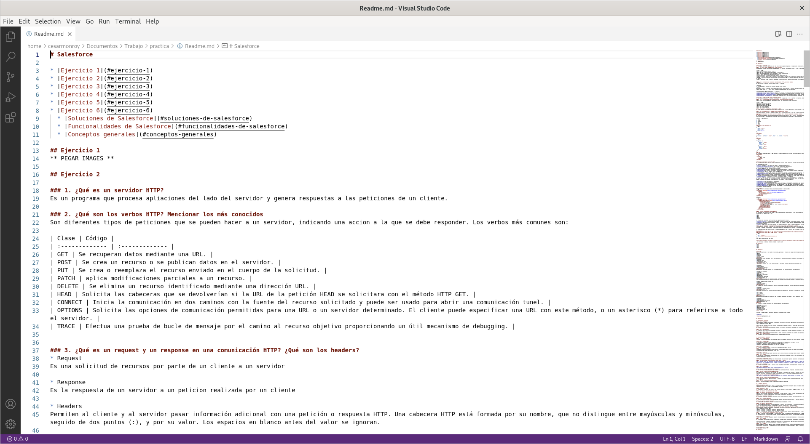
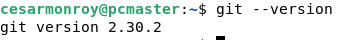
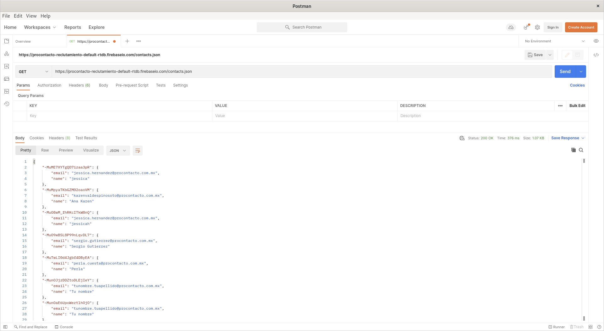
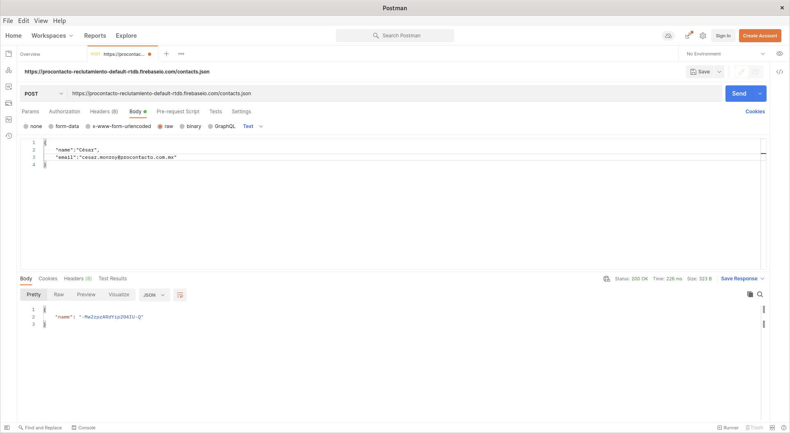
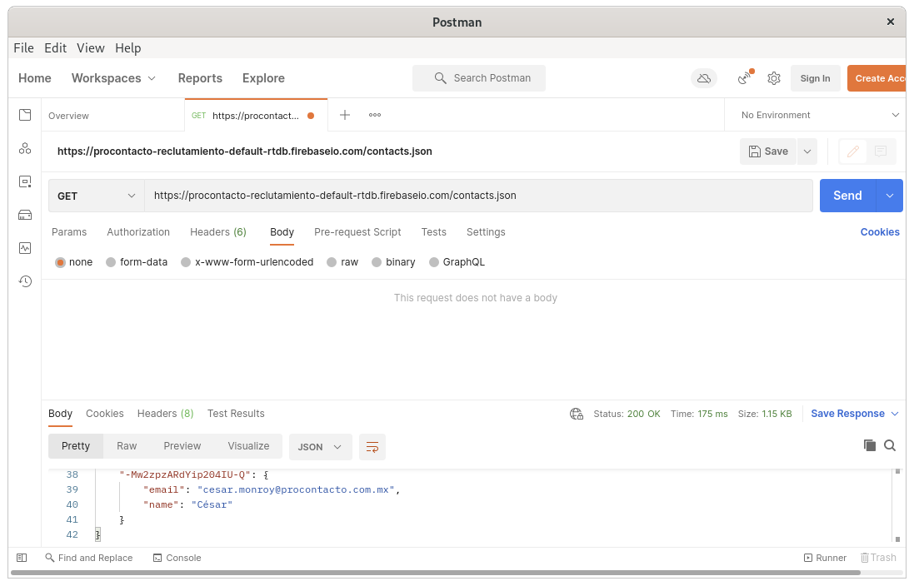
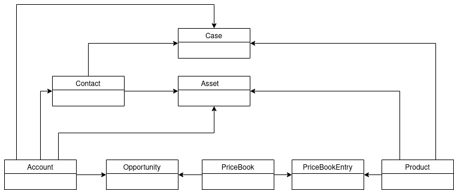
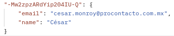

# Salesforce

* [Ejercicio 1](#ejercicio-1)
* [Ejercicio 2](#ejercicio-2)
* [Ejercicio 3](#ejercicio-3)
* [Ejercicio 4](#ejercicio-4)
* [Ejercicio 5](#ejercicio-5)
* [Ejercicio 6](#ejercicio-6)
  * [Soluciones de Salesforce](#soluciones-de-salesforce)
  * [Funcionalidades de Salesforce](#funcionalidades-de-salesforce)
  * [Conceptos generales](#conceptos-generales)

## Ejercicio 1
### VS CODE

### GIT


## Ejercicio 2

### 1. ¿Qué es un servidor HTTP?

Es un programa que procesa apliaciones del lado del servidor y genera respuestas a las peticiones de un cliente.  

### 2. ¿Qué son los verbos HTTP? Mencionar los más conocidos

Son diferentes tipos de peticiones que se pueden hacer a un servidor, indicando una acción a la que se debe responder. Los verbos más comunes son:

| Clase | Código |
| :------------- | :------------- |
| GET | Se recuperan datos mediante una URL. |
| POST | Se crea un recurso o se publican datos en el servidor. |
| PUT | Se crea o reemplaza el recurso enviado en el cuerpo de la solicitud. |
| PATCH | aplica modificaciones parciales a un recurso. |
| DELETE | Se elimina un recurso identificado mediante una dirección URL. |
| HEAD | Solicita las cabeceras que se devolverían si la URL de la petición HEAD se solicitara con el método HTTP GET. |
| CONNECT | Inicia la comunicación en dos caminos con la fuente del recurso solicitado y puede ser usado para abrir una comunicación túnel. |
| OPTIONS | Solicita las opciones de comunicación permitidas para una URL o un servidor determinado. El cliente puede especificar una URL con este método, o un asterisco (*) para referirse a todo el servidor. |
| TRACE | Efectúa una prueba de bucle de mensaje por el camino al recurso objetivo proporcionando un útil mecanismo de debugging. |


### 3. ¿Qué es un request y un response en una comunicación HTTP? ¿Qué son los headers?

* Request
Es una solicitud de recursos por parte de un cliente a un servidor

* Response
Es la respuesta de un servidor a un petición realizada por un cliente

* Headers
Permiten al cliente y al servidor pasar información adicional con una petición o respuesta HTTP. Una cabecera HTTP está formada por su nombre, que no distingue entre mayúsculas y minúsculas, seguido de dos puntos (:), y por su valor. Los espacios en blanco antes del valor se ignoran.

Las cabeceras puede agruparse de acuerdo a su contexto:

**Cabecera de consulta (request header)**: Cabeceras que contienen más información sobre el contenido que va a obtenerse o sobre el cliente.
**Cabecera de respuesta (response header)**: Cabeceras que contienen más información sobre el contenido, como su origen o el servidor (nombre, versión, etc.).
**Cabecera de entidad (representation header)**: Cabeceras que contienen más información sobre el cuerpo de la entidad, como el tamaño del contenido o su tipo MIME.
**Cabecera general (payload header)**: Cabeceras que se aplican tanto a las peticiones como a las respuestas, pero sin relación con los datos que finalmente se transmiten en el cuerpo.

### 4. ¿Qué es un queryString? (En el contexto de una url)

Es una cadena incluido en el url después de el símbolo (?), es pasado por el url en la forma de parámetros. Puede contener uno o más parámetros y cada parámetros es separado por el símbolo (&)

### 5. ¿Qué es el responseCode? ¿Qué significado tiene los posibles valores devueltos?

Indican si una solicitud HTTP se ha completado con éxito. Las respuestas se agrupan en 5 clases:

| Clase | Código |
| :------------- | :------------- |
| Respuestas informativas |100-199|
| Respuestas exitosas |200-299|
| Mensajes de redirección |300-399|
| Error del cliente |400-499|
| Error del servidor |500-599|

### 6. ¿Cómo se envía la data en un Get y cómo en un POST?

El método GET envía la información a través de la URL mientras que el método POST la envía en el cuerpo de la petición HTTP.

### 7. ¿Qué verbo http utiliza el navegador cuando accedemos a una página?

Generalmente se suele utilizar el verbo GET, a menos que se utilicen formularios, en ese caso se suele utilizar el verbo POST

### 8. Explicar brevemente qué son las estructuras de datos JSON y XML dando ejemplo de estructuras posibles.

#### JSON

Es una estructura de datos utilizada para programas JavaScript ligero, fácil de leer y escribir, no requiere tanta codificación y se procesa bastante rápido. A menudo se utiliza para serializar datos estructurados e intercambiarlos a través de una red, normalmente entre un servidor y aplicaciones web.

Consta de 6 tipos de datos.

1. Cadena
2. Número
3. Booleano
4. Nulo
5. Objeto
6. Serie

##### Cadena,número, booleano, nulo

```JSON
{
  "cadena":"César",
  "numero": 123,
  "booleano": true,
  "nulo": null,
}
```

##### Objeto

```JSON
{
  "Persona" :   { "Nombre" : "César" , "Edad" : 42 , "Ciudad" : "México" }
}
```

##### Serie

```JSON
{
  "Persona" : [
    {
      "Nombre" : "César",
      "Edad" : 20,
      "Ciudad": "México"
    }
    {
      "Nombre" : "Mario",
      "Edad" : 42,
      "Ciudad": "México"
    }
  ]
}
```

#### XML

Es un lenguaje de marcado similar a HTML, pero es de propósito general y su principal función es compartir datos a través de diferentes sistemas, como por ejemplo Internet.

##### Ejemplo

```XML
<message>
    <warning>
         Hola, mundo
    </warning>
</message>
```

### 9. Explicar brevemente el estándar SOAP

Es un protocolo que define cómo dos objetos en diferentes procesos pueden comunicarse por medio de intercambio de datos XML.

Se compone de tres partes:
* **Sobre** (envelope): El cual define qué hay en el mensaje y cómo procesarlo.
* **Conjunto de reglas de codificación** para expresar instancias de tipos de datos.
* **La Convención** para representar llamadas a procedimientos y respuestas.

El protocolo SOAP tiene tres características principales:
* **Extensibilidad** (seguridad y WS-routing son extensiones aplicadas en el desarrollo).
* **Neutralidad** (bajo protocolo de transporte TCP puede ser utilizado sobre cualquier protocolo de aplicación como HTTP, SMTP o JMS).
* **Independencia** (permite cualquier modelo de programación).

Un mensaje SOAP es un documento XML ordinario con una estructura definida en la especificación del protocolo. Dicha estructura la conforman las siguientes partes:
* **Envelope(obligatoria)** : Raíz que de la estructura, es la parte que identifica al mensaje SOAP como tal.
* **Header**: Esta parte es un mecanismo de extensión ya que permite enviar información relativa a cómo debe ser procesado el mensaje. Es una herramienta para que los mensajes puedan ser enviados de la forma más conveniente para las aplicaciones. El elemento "Header" se compone a su vez de "Header Blocks" que delimitan las unidades de información necesarias para el header.
* **Body(obligatoria)** : Contiene la información relativa a la llamada y la respuesta.
* **Fault**: Bloque que contiene información relativa a errores que se hayan producido durante el procesado del mensaje y el envío desde el "SOAP Sender" hasta el "Ultimate SOAP Receiver".

El modelo SOAP está definido como un sistema distribuido, en el que intervienen diferentes nodos. los nodos se comunican uno asumiendo el rol de **SOAP Sender** y otro el de **SOAP Receiver**. Se definen diferentes tipos de nodos en función del rol que asumen en el envío del mensaje:

* **SOAP Sender**: Nodo que transmite un mensaje SOAP.
* **SOAP Receiver**: Nodo que acepta un mensaje.
* **SOAP message path**: Conjunto de nodos por los cuales debe pasar un mensaje SOAP, incluyendo el nodo inicial, cero o más nodos intermediarios y el SOAP Receiver definitivo.
* **Initial SOAP sender**: El "sender" que origina el mensaje y que es el punto de inicio del camino que seguirá el mensaje.
* **SOAP intermediary**: El intermediario actúa como SOAP receiver y como SOAP sender, ya que primero recibe el mensaje para después reenviarlo al siguiente nodo en el camino.
* **Ultimate SOAP receiver**: Destino final del mensaje SOAP, es el responsable de procesarlo. Cabe destacar que el mensaje podría no llegar al receptor definitivo debido a que problemas en los intermediarios hagan que se pierda.

#### Ejemplos

Cliente solicitaría información de un producto a un proveedor de servicios Web:
```XML
<soap:Envelope xmlns:soap="http://schemas.xmlsoap.org/soap/envelope/">
   <soap:Body>
     <getProductDetails xmlns="http://warehouse.example.com/ws">
       <productId>827635</productId>
     </getProductDetails>
   </soap:Body>
</soap:Envelope>
```
Respuesta:
```XML
<soap:Envelope xmlns:soap="http://schemas.xmlsoap.org/soap/envelope/">
   <soap:Body>
     <getProductDetailsResponse xmlns="http://warehouse.example.com/ws">
       <getProductDetailsResult>
         <productName>Toptimate 3-Piece Set</productName>
         <productId>827635</productId>
         <description>3-Piece luggage set.  Black Polyester.</description>
         <price>96.50</price>
         <inStock>true</inStock>
       </getProductDetailsResult>
     </getProductDetailsResponse>
   </soap:Body>
 </soap:Envelope>
```

### 10. Explicar brevemente el estándar REST Full

Es considerado como un servicio web basado en REST (Representational State Transfer), es una aplicación que usa el protocolo HTTP, por lo que el cliente tiene acceso a la información del servidor a través de HTTP requests como lo son:

* GET
* POST
* PUT
* PATCH
* DELETE

Un API puede ser considerado Restful si tiene las siguientes características:

* **Cliente-servidor**: El cliente y el servidor deben trabajar por separado. El cliente maneja la parte del front end y el servidor la parte del back end.
* **Stealess**: El API se maneja sin estados, es decir, las llamadas se pueden realizar independientemente una de otra, y cada una contiene toda la información necesaria para completarse por sí misma satisfactoriamente.
* **Cache**: Ya que un API Restful es Statelees esto puede incrementar el manejo de conjuntos grandes de información en las llamadas, esta API deberá estar diseñada para almacenar datos en cache.

### 11. ¿Qué son los headers en un request? ¿Para qué se utiliza el key Content-type en un header?

Las cabeceras en los request se utilizan para proporcionar información sobre el contexto de la petición de modo que el servidor pueda adaptar la respuesta, por ejemplo para indicar el formato permitido y preferido de la respuesta, proporcionar credenciales de autenticación, controlar el almacenamiento en cache,etc.

El encabezado Content-Type de la solicitud se establece para permitir que el servicio sepa el tipo de formato que tienen los datos que se envían y así poder procesarlos correctamente.

## Ejercicio 3
### 1. Realizar un request GET a la URL: https://procontacto-reclutamiento-default-rtdb.firebaseio.com/contacts.json


### 2. Realizar un request POST a la URL anterior, y con body:

```JSON
{
  "name":"Tu nombre",
  "email": "tunombre.tuapellido@procontacto.com.mx"
}
```
Tip: (Marcar la opción “raw” como body)


### 3. Realizar nuevamente un request GET a la URL: https://procontacto-reclutamiento-default-rtdb.firebaseio.com/contacts.json



¿Qué diferencias se observan entre las llamadas el punto 1 y 3?
Al realizar la ultima petición, entre los datos ya se encuentran los datos que envié.

## Ejercicio 4

https://trailblazer.me/id/cesarmonroy

## Ejercicio 5

### 1. Lead

Es un cliente potencial el cual puede ser calificado, gestionado y enviado a los equipos de ventas para una mayor efectividad al momento de ofrecer productos. Los datos obligatorios que almacena son:
* Nombre
* Compañía
* Estatus
* Creado por
### 2. Account

Representa una cuenta individual, que es una organización o persona involucrada con su negocio (como clientes, competidores y socios). Los datos obligatorios que almacena son:
* Creado por
* Nombre de cuenta
* Propietario de cuenta
* Ultima modificación por
### 3. Contact

Representa un contacto, que es una persona asociada a una cuenta. Los datos obligatorios que almacena son:

* Creado por
* Nombre completo
* Propietario del contacto
* Ultima modificación por
### 4. Opportunity

Representa una oportunidad de venta o de un acuerdo pendiente. Los datos obligatorios que almacena son:

* Categoría de previsión
* Creado por
* Etapa
* Fecha de cierre
* Nombre de la oportunidad
* Probabilidad
* Propietario de oportunidad
* Ultima modificación por
### 5. Product

Representa un producto que una organización vende. Este objeto tiene varios campos que se utilizan sólo para la cantidad y los horarios de ingresos (por ejemplo, las anualidades). Los calendarios sólo están disponibles para las organizaciones que han activado las funciones de productos y calendarios. Si estas funciones no están activadas, los campos de planificación no aparecerán.

Los datos obligatorios que almacena son:
* Creado por
* Nombre del producto
* Ultima modificación por
### 6. PriceBook

Es un objeto que almacena los objetos de registro del precio de los productos. Los datos obligatorios que almacena son:

* Creado por
* Nombre de la lista de precios
* Ultima modificación por
### 7. Quote

Conjunto de presupuestos que muestran diferentes combinaciones de productos, descuentos y cantidades. De ese modo que los clientes pueden comparar precios. Los datos obligatorios que almacena son:

* Id de Cuenta
* Id de Contacto
* Id de Oportunidad
* Nombre
* Descripción
### 8. Asset

Representa un artículo de valor comercial, como un producto vendido por una empresa o por un competidor, que un cliente ha comprado. Los datos obligatorios que almacena son:

* Creado por
* Nombre de activo
* Propietario de activo
* Tiene gestión de ciclo de vida
* Ultima modificación por
### 9. Case

Es un asunto o problema del cliente. Los datos obligatorios que almacena son:

* Creado por
* Fecha/Hora de apertura
* Horario de oficina
* Número del caso
* Propiedad del caso
* Ultima modificación por
### 10. Article

Proporciona acceso de sólo lectura a un artículo y la posibilidad de eliminar el artículo maestro. Algunos datos que almacena son:
* ArchivedDate
* ArticleNumber
* CaseAssociationCount

### Diagrama




## Ejercicio 6

## Soluciones de Salesforce

### A. ¿Qué es Salesforce?

Salesforce Sales Cloud es una plataforma de gestión de relaciones con el cliente (CRM) diseñada para respaldar las ventas, el marketing y la atención al cliente en contextos de empresa a empresa (B2B) y de empresa a cliente (B2C).

Admite todas las nubes de Salesforce, funciones personalizadas creadas por clientes y socios, que van desde formatos de página a aplicaciones a escala completa.

### B. ¿Qué es Sales Cloud?

Es un servicio que ofrece Salesforce enfocado en ganar más clientes, conociendo sus necesidades con ayuda de tecnologías como IA y big data.

### C. ¿Qué es Service Cloud?

Es un servicio que ofrece Salesforce enfocado en resolver rápidamente los problemas de atención al cliente en cualquier canal.

### D. ¿Qué es Health Cloud?

Es un producto que ofrece Salesforce enfocado en el sector de la salud, conectando los pacientes con organizaciones encargas de proporcionar atención medica.

### E. ¿Qué es Marketing Cloud?

Es un producto que ofrece Salesforce para la gestión de marketing personalizado.


## Funcionalidades de Salesforce

### A. ¿Qué es un RecordType?

Los tipos de registros determinan los procesos de negocio, los formatos de página y los valores de lista de selección a los que los usuarios tienen acceso.

### B. ¿Qué es un ReportType?

Es una clase que contiene el nombre único de la API y el nombre de visualización del tipo de informe.
Los siguientes son métodos para ReportType. Todos son métodos de instancia.
* getLabel() - Devuelve el nombre localizado del tipo de informe.
* getTipo() - Devuelve el identificador único del tipo de informe.

### C. ¿Qué es un Page Layout?

Es un diseño de pagina y se puede crear diferentes para para cada tipo de usuario.

### D. ¿Qué es un Compact Layout?

Los formatos compactos controlan qué campos aparecen en el encabezado de un formato mas pequeño, principalmente para aplicaciones moviles. Para cada objeto, puede asignar hasta 10 campos, incluyendo el campo Nombre, para mostrar en ese área.

### E. ¿Qué es un Perfil?

Permite define las acciones que puede realizar un usuario en la aplicación, así como qué datos u objetos puede editar o eliminar.

### F. ¿Qué es un Rol?

Se usa junto con la configuración de colaboración para determinar los niveles de acceso de los usuarios a los datos de Salesforce. Los usuarios pueden acceder a los datos de todos los usuarios que tengan por debajo en la jerarquía.

### G. ¿Qué es un Validation Rule?

Las reglas de validación verifican que los datos ingresados por usuarios en registros cumplen los estándares que especifica antes de poder guardarlos.

### H. ¿Qué diferencia hay entre una relación Master Detail y Lookup?
En Salesforce existen dos tipos de campos de relación.

##### Lookup

* Este campo es un campo editable. Después de guardar el registro, podemos editar el registro y asignar un nuevo valor a estos campos.
* No es un campo de mandato . Sin embargo , podemos hacer esto según sea necesario y convertirlo en un campo obligatorio.
* Débilmente acoplado. Cuando se elimina un padre, los registros secundarios no se eliminan. Este campo no tiene la función de eliminación en cascada.

#### Master Datail
* No es un campo Editable , sin embargo, podemos hacerlo editable marcando la casilla de verificación Permitir cambio de parentesco en el momento de la creación del campo (también podemos actualizar el campo ya creado).
* Este campo por defecto es un campo obligatorio.
* Estrechamente acoplado. Cuando se elimina un padre, se eliminan los registros secundarios. Esta variante tiene la función de eliminación en cascada.

### I. ¿Qué es un Sandbox?

Es un lugar donde se puede probar y crear sin riesgo de cambiar o perder datos de su organización principal o de producción de Salesforce.

### J. ¿Qué es un ChangeSet?

Permite enviar personalizaciones de una organización Salesforce a otra.

### K. ¿Para qué sirve el import Wizard de Salesforce?

Es una interfaz unificada que permite importar datos para cuentas y contactos, prospectos, soluciones y objetos personalizados.

### L. ¿Para qué sirve la funcionalidad Web to Lead?

Sirve para utilizar un formulario del sitio Web para capturar la información del visitante y almacenar esa información, debido a que un formulario bien diseñado puede capturar información clave sobre los visitantes, incluyendo datos demográficos y detalles sobre su interés en sus productos y servicios.

### M. ¿Para qué sirve la funcionalidad Web to Case?

Recoge las solicitudes de asistencia de los clientes directamente desde el sitio web de la empresa y genera automáticamente nuevos casos.

### N. ¿Para qué sirve la funcionalidad Omnichannel?

Permite aplicar prácticas de negocio eficientes a elementos de trabajo entrantes, independientemente del canal. Y si su organización utiliza bots, puede incluso enrutar el trabajo a un bot en vez de a un agente.

### O. ¿Para qué sirve la funcionalidad Chatter?

Permite a sus usuarios trabajar juntos, comunicarse y compartir información.

##   Conceptos generales

### A. ¿Qué significa SaaS?

Software como servicio (SaaS) es un modelo de distribución de software donde el soporte lógico y los datos que maneja se alojan en servidores de una compañía de tecnologías de información y comunicación, a los que se accede vía Internet desde un cliente.

### B. ¿Salesforce es Saas?

La plataforma se proporciona como software como servicio (SaaS) para acceso basado en navegador; también está disponible una aplicación móvil.

### C. ¿Qué significa que una solución sea Cloud?

Significa que los sistemas se encuentra instalados en un lugar ajeno a la empresa y son accedidos a traves de internet.

### D. ¿Qué significa que una solución sea On-Premise?

Significa que los sistemas se encuentran instalados en la propia empresa, es decir, máquinas conectadas a la red local de la empresa. Los empleados acceden desde sus puestos de trabajo a estos ordenadores para utilizar las aplicaciones necesarias de los diferentes departamentos.

### E. ¿Qué es un pipeline de ventas?

Es un conjunto de acciones específicas realizadas por los comerciantes para convertir una oportunidad/lead en cliente.

### F. ¿Qué es un funnel de ventas?

Es la representación visual de las oportunidades que pasan de una fase del proceso a otra, y las tasas de conversión correspondientes.

### G. ¿Qué significa Customer Experience?

Es la percepción que tienen los clientes de su experiencia con su empresa o marca.

### H. ¿Qué significa omnicanalidad?

Es una estrategia de comunicación utilizada para estar en contacto con los prospectos o clientes a través de diferentes canales (email, redes sociales, sitio web, etc.). El uso de los diferentes canales debe hacerse bajo una misma estrategia para llegar al consumidor en el momento indicado.

### I. ¿Qué significa que un negocio sea B2B?¿Qué significa que un negocio sea B2C?¿Qué es un KPI?

Salesforce Sales Cloud es una plataforma de gestión de relaciones con el cliente (CRM) diseñada para respaldar las ventas, el marketing y la atención al cliente en contextos de empresa a empresa (B2B) y de empresa a cliente (B2C).
* B2B: Es la atencion al cliente en contexto de empresa a empresa.
* B2C: Es la atencion al cliente en contexto de empresa a cliente.
* KPI: Es un indicador del rendimiento del trabajo que se esta realizando sobre los objetivos marcados y es la forma de conocer si se están cumpliendo.

### J. ¿Qué es una API y en qué se diferencia de una Rest API?

Un API es un conjunto de funcionalidades o recursos que nos expone un sistema para poder interactuar con él desde otro sistema, esto sin importar ni los lenguajes de programación en que cada uno de ellos esté escrito ni la tecnología ni nada, mientras que Rest API es un estilo de arquitectura de software para realizar una comunicación cliente-servidor.

### K. ¿Qué es un Proceso Batch?

Proceso mediante el cual una computadora completa lotes de trabajos, a menudo simultáneamente, en orden secuencial y sin parar.

### L. ¿Qué es Kanban?

Es un sistema de desarrollo que consiste en mejorar el flujo de trabajo de un equipo, aumentando al mismo tiempo la productividad y la calidad del producto final.

Las tareas se dividen en pequeñas fases que se realizan de forma consecutiva, en lugar de comenzar nuevas tareas y realizarlas todas de una manera más o menos simultánea, deberá llevarse a término cada una de las fases que las constituyen antes de empezar la siguiente.

### M. ¿Qué es un ERP?

Enterprise Resource Planning (ERP) se refiere al tipo de software que usan las organizaciones para administrar las actividades empresariales diarias, como la contabilidad, el abastecimiento, la administración de proyectos, el cumplimiento y la gestión de riesgos y las operaciones de la cadena de suministro.

### N. ¿Salesforce es un ERP?

No, pero puede ejecutar ERP.

## Ejercicio 7

### A. Consultar tu ID haciendo un GET con POSTMAN.



### C. Desarrollar un trigger para que cuando un usuario Modifica o Crea un contacto de Salesforce completando el campo generado el punto B con TU id obtenido en el punto A, se invoque al Web Service con el idprocontacto obtenga los datos de email de la respuesta y actualice el campo email del contacto.

```JAVA
trigger TriggerContact on Contact (before insert, before update) {
    for(Contact contacto : Trigger.new)
    {
        if(contacto.idprocontacto__c == '-Mw2zpzARdYip204IU-Q')
        {
            Http http = new Http();
            HttpRequest request = new HttpRequest();
            request.setEndpoint('https://procontacto-reclutamiento-default-rtdb.firebaseio.com/contacts/' + contacto.idprocontacto__c+'.json');
            request.setMethod('GET');
            HttpResponse response = http.send(request);
            if(respuesta.getStatusCode()==200)
            {
	             Map<String, Object> resultados = (Map<String, Object>) JSON.deserializeUntyped(respuesta.getBody());
               contacto.Email=resultados.get('email');
               update contacto;
             }
      }
   }
}
```
